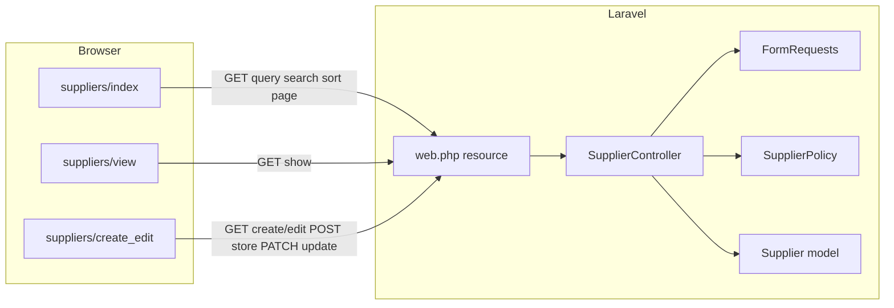

# Suppliers module — implementation plan

## Goals

- Persist suppliers with: UUID `id` (PK), required `contact_person_name`, `company_name`, `phone`, `email`, `address`, `category` (`OEM` | `Aftermarket` | `Other`), `created_at`, `updated_at`, **soft deletes**.
- Backend: model, migration(s), factory, policy, `SupplierController` with Form Requests and validation, `Route::resource` under auth.
- Frontend: three Inertia pages under `resources/js/pages/suppliers/` — list (DataTable + search + pagination + sort + row icon actions), detail view with back link, shared create/edit form — matching the **visual language** used today (`landing-surface`, bordered rounded cards, muted copy, shadcn-style inputs/buttons) as seen on `resources/js/pages/customers/index.tsx` and `resources/js/components/customers/customer-profile-dialog.tsx`.
- Delete: confirm before `router.delete` (same `window.confirm` pattern as `resources/js/components/customers/customer-row-actions.tsx`; no `AlertDialog` in repo today).

## Architecture (request flow)



## Backend

### 1. Category representation

- Add a string-backed PHP enum, e.g. `app/Enums/SupplierCategory.php`, with cases `Oem`, `Aftermarket`, `Other` and **values** exactly `OEM`, `Aftermarket`, `Other` (match user wording; display labels can use `->name` or explicit labels in the UI).
- On `app/Models/Supplier.php`: `protected $casts = ['category' => SupplierCategory::class];`
- Validation: `Rule::enum(SupplierCategory::class)` in store/update requests.

### 2. Migration

- New migration `create_suppliers_table`:
  - `$table->uuid('id')->primary();`
  - string columns for `contact_person_name`, `company_name`, `phone`, `email` (lengths consistent with `create_customers_table`: e.g. 255 for strings, `text` for `address`).
  - `category` as `string` (or Laravel enum column if you prefer DB-level enum on Postgres only — simplest cross-db approach is `string` + app validation).
  - `timestamps()` + `softDeletes()`.
  - **Indexes** (optional first pass): btree on `deleted_at` for listing; consider composite later. **Optional follow-up** (like customers): in the same `create_suppliers_table` migration, after `Schema::create`, add a `pgsql`-only block with `CREATE EXTENSION IF NOT EXISTS pg_trgm` and GIN indexes on searchable columns (`contact_person_name`, `company_name`, `email`, `phone`) — mirror the pattern in `database/migrations/2026_04_09_220754_create_customers_table.php` (raw `DB::statement` calls + matching `down()` cleanup).

### 3. Model and factory

- `app/Models/Supplier.php`: `HasFactory`, `SoftDeletes`, **`Illuminate\Database\Eloquent\Concerns\HasUuids`** (Laravel assigns UUID on create; route key remains `id`). `$fillable` lists all non-null business fields; hidden none needed.
- `database/factories/SupplierFactory.php`: realistic faker data + random `SupplierCategory`.
- Optional `database/seeders/SupplierSeeder.php` if you want demo rows locally (not required for tests if factory suffices).

### 4. Authorization

- `app/Policies/SupplierPolicy.php`: clone the allow-all + TODO pattern from `app/Policies/CustomerPolicy.php` so behavior matches existing app (Laravel auto-discovers `Supplier` → `SupplierPolicy`; no `AppServiceProvider` registration needed).

### 5. Form requests

Mirror customer split:

- `app/Http/Requests/Suppliers/IndexSuppliersRequest.php`: `authorize(): true`; rules: `search` (nullable string max 255), `sort` (`Rule::in([...])` for list columns: `contact_person_name`, `company_name`, `phone`, `email`, `category`), `direction` (`asc`|`desc`). Do **not** overload index with `view`/`edit` query params (customers-specific); suppliers use real routes.
- `app/Http/Requests/SupplierRequests/StoreSupplierRequest.php`: `authorize` via `$this->user()->can('create', Supplier::class)`; rules for all required fields + `email` **unique** on `suppliers` (same idea as `StoreCustomerRequest`).
- `app/Http/Requests/SupplierRequests/UpdateSupplierRequest.php`: `authorize` via `can('update', $supplier)`; same field rules with `Rule::unique('suppliers', 'email')->ignore($this->supplier->getKey(), 'id')`.

### 6. Controller

`app/Http/Controllers/SupplierController.php` — **full** resource (unlike customers which use `except(['create','edit'])` in `routes/web.php`):

| Action | Behavior |
|--------|----------|
| `index` | Authorize `viewAny`; validated search/sort/direction; `Supplier::query()` selecting columns needed for the table + `id`; `where` OR `like` across contact name, company, phone, email (and optionally category string); `orderBy`; `paginate(10)->withQueryString()`; `Inertia::render('suppliers/index', ['suppliers', 'filters'])`. |
| `create` | Authorize `create`; `Inertia::render('suppliers/create_edit', ['supplier' => null])`. |
| `store` | `StoreSupplierRequest`; create; `Inertia::flash('toast', ...)` like `CustomerController`; `redirect()->route('suppliers.show', $supplier)`. |
| `show` | Authorize `view`; `Inertia::render('suppliers/view', ['supplier' => $supplier])` with full attributes. |
| `edit` | Authorize `update`; `Inertia::render('suppliers/create_edit', ['supplier' => $supplier])`. |
| `update` | `UpdateSupplierRequest`; flash; redirect to `suppliers.show`. |
| `destroy` | Authorize `delete`; `$supplier->delete()` (soft); flash; `redirect()->route('suppliers.index')`. |

**Implicit route model binding**: default `{supplier}` resolves by `id` (UUID string). No custom `getRouteKeyName` unless you change keys.

### 7. Routes

Inside the existing `Route::middleware(['auth', 'verified'])->group` in `routes/web.php`:

```php
Route::resource('suppliers', SupplierController::class);
```

(No `except` — you need `create` and `edit` for dedicated pages.)

### 8. Tests

Add `tests/Feature/SupplierTest.php` modeled on `tests/Feature/CustomerTest.php`:

- Guest redirected from supplier routes.
- Index pagination (10), default sort/filters, search narrows results, sort toggles direction.
- CRUD happy paths + validation errors (422 on invalid category/email duplicate).
- Destroy soft-deletes (`assertSoftDeleted`).
- Assert Inertia component names: `suppliers/index`, `suppliers/view`, `suppliers/create_edit`.

Run `php artisan test --filter=Supplier`.

## Frontend

### 9. Types and list URL helpers

- `resources/js/types/supplier.ts`: `Supplier` type (`id: string`, all fields; `category` as the three string literals or shared union); `SupplierListFilters`; `PaginatedSuppliers` (same shape as `resources/js/types/customer.ts`).
- `resources/js/lib/suppliers-index-query.ts`: like `resources/js/lib/customers-index-query.ts` but only `search`, `sort`, `direction`, `page` (no `view`/`edit`).
- `resources/js/hooks/use-supplier-list-query.ts`: debounced search (`useDebouncedValue`), sorting handler, `router.get` to Wayfinder `index` URL — parallel structure to `use-customer-list-query.ts` minus profile/edit concerns.

### 10. Shared UI pieces (optional small components)

To keep `resources/js/pages/suppliers/index.tsx` readable, mirror the customer split:

- `resources/js/components/suppliers/suppliers-columns.tsx`: column defs for contact person, company, phone, email, category; actions column.
- `resources/js/components/suppliers/supplier-row-actions.tsx`: **Eye** → `router.get(show.url(id))`; **Pencil** → `router.get(edit.url(id))`; **Trash2** → `window.confirm('…')` then `router.delete(destroy.url(id))` (tooltips + `aria-label` like customer row actions).
- `resources/js/components/suppliers/suppliers-pagination.tsx`: copy `customers-pagination.tsx` with `PaginatedSuppliers` type.

Category column: render a `Badge` variant for quick scan (optional).

### 11. Pages (all under `resources/js/pages/suppliers/`)

**`index.tsx`**

- Same page shell as customers: `Head`, title/description row, primary **Add supplier** `Button` linking to `create` route (Wayfinder), search `Input` with `Search` icon, “Showing x–y of z”, `landing-surface` wrapper, `DataTable` with `getRowId={(row) => row.id}`, empty states for empty DB vs no search hits, `SuppliersPagination` when `last_page > 1`.
- `layout.breadcrumbs`: Dashboard → Suppliers index (same pattern as `CustomersIndex.layout`).

**`view.tsx`**

- Top: `Button` as child of `Link` back to suppliers index (or `router.visit`); page title = company name (or contact person).
- Body: responsive grid of “profile field” cards reusing the **visual pattern** from `ProfileField` in `customer-profile-dialog.tsx` (icon + uppercase label + value); show all stored fields including timestamps if desired.
- Breadcrumbs: Dashboard → Suppliers → current supplier (view).

**`create_edit.tsx`**

- Single page: `supplier === null` → create mode, else edit mode.
- Use Inertia `<Form>` with Wayfinder controller actions (same approach as `customer-form-dialog.tsx` importing `SupplierController` from `@/actions/App/Http/Controllers/SupplierController` after generation): `store.form()` vs `update.form.patch(supplier.id)` (PATCH).
- Fields: all required inputs + `Select` for category (three options). Reuse `Input`, `Label`, `InputError`, textarea class pattern from customer form (`cn` + shared textarea classes).
- Cancel: `Link` to index (create) or to `show` (edit) — pick one consistent pattern.
- Breadcrumbs: Dashboard → Suppliers → Create / Edit.

### 12. Navigation and Wayfinder

- `resources/js/components/app-sidebar.tsx`: add a nav item (e.g. `Truck` or `Package` from `lucide-react`) pointing to suppliers index via `@/routes/suppliers` (generated).
- After route/controller changes, run **`php artisan wayfinder:generate --with-form`** (or rely on Vite plugin per `AGENTS.md`) so `resources/js/routes` and `resources/js/actions` include suppliers.

## Verification checklist

- `php artisan migrate`
- `php artisan test --filter=Supplier`
- `vendor/bin/pint --dirty` (PHP style)
- `npm run lint` / `npm run types` if present
- Manual: auth user → sidebar → list → create → view → edit → delete (confirm row disappears and DB has `deleted_at`).

## Key references (copy patterns from)

- List + search + table: `resources/js/pages/customers/index.tsx`, `resources/js/hooks/use-customer-list-query.ts`, `resources/js/components/customers/customers-columns.tsx`
- Row actions + delete confirm: `resources/js/components/customers/customer-row-actions.tsx`
- Controller + requests + policy: `app/Http/Controllers/CustomerController.php`, `app/Http/Requests/Customers/IndexCustomersRequest.php`, `app/Http/Requests/CustomerRequests/StoreCustomerRequest.php`
- Soft deletes model: `app/Models/Customer.php`
