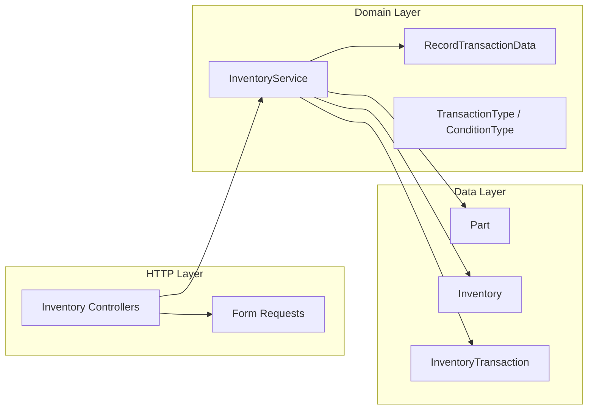
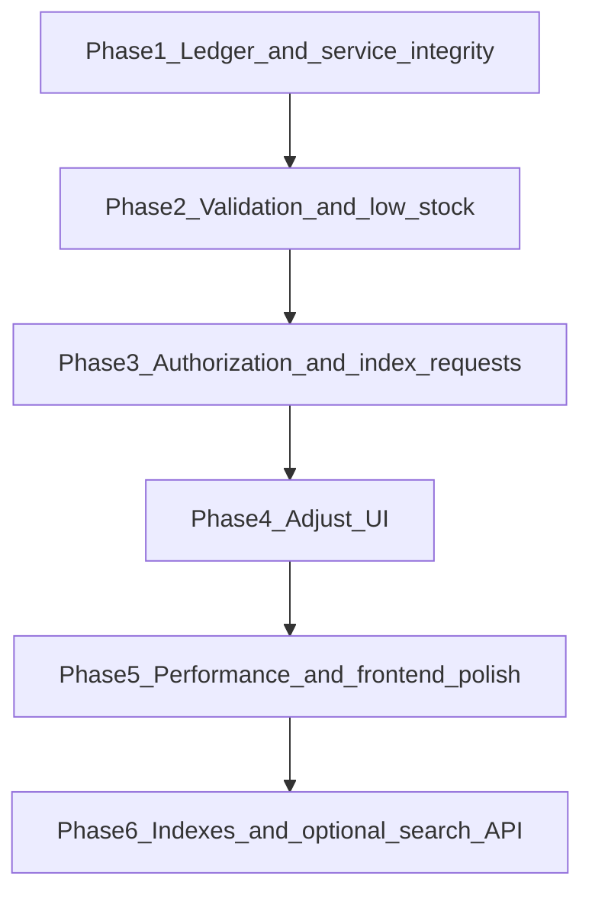

# Inventory Module Audit and Remediation Plan

## Scope reviewed

**Modified (5):** [`routes/web.php`](routes/web.php), [`bootstrap/providers.php`](bootstrap/providers.php), [`database/seeders/DatabaseSeeder.php`](database/seeders/DatabaseSeeder.php), [`resources/js/components/app-sidebar.tsx`](resources/js/components/app-sidebar.tsx), [`resources/js/types/index.ts`](resources/js/types/index.ts)

**New (~55):** Backend (models, migrations, service, DTOs, enums, controllers, requests, provider, exceptions, factories, seeder, 4 test files) + frontend (8 pages, 18 components, hooks/libs/types)



---

## What is done well

- **Stock writes are mostly safe:** [`InventoryService::recordTransaction`](app/Services/InventoryService.php) uses `DB::transaction`, `lockForUpdate()`, and `InsufficientStockException` before persisting ledger + on-hand delta.
- **Layering matches the build plan:** Interface binding in [`InventoryServiceProvider`](app/Providers/InventoryServiceProvider.php), readonly DTOs, domain exceptions, `final` controllers.
- **Frontend conventions:** Wayfinder routes/actions throughout; no hardcoded `/inventory` paths; Inertia `<Form>` with `.form()` bindings; debounced parts search in [`use-part-list-query.ts`](resources/js/hooks/use-part-list-query.ts).
- **Query hygiene in several places:** Selective `with([...])` columns on dashboard recent transactions; `addcslashes` on LIKE search in [`PartController`](app/Http/Controllers/Inventory/PartController.php).
- **Service tests are substantive:** [`InventoryServiceTest`](tests/Feature/InventoryServiceTest.php) covers deltas, stocktake, restock on-order, low stock, summaries.

---

## Critical issues (fix first)

### 1. Ledger integrity — transaction delete (your choice: append-only)

**Problem:** [`InventoryTransactionController::destroy`](app/Http/Controllers/Inventory/InventoryTransactionController.php) soft-deletes ledger rows without reversing stock, which breaks audit trust.

**Fix:**
- Remove `destroy` from the resource route in [`routes/web.php`](routes/web.php).
- Delete `destroy` method and [`transaction-row-actions.tsx`](resources/js/components/inventory/transaction-row-actions.tsx) delete action.
- Remove `include_trashed` filter UI/logic unless you add a read-only “archived” story later.
- Add tests asserting `DELETE` transactions returns 405/not found.

### 2. Split atomicity in `adjust` (must fix before UI)

**Problem:** [`InventoryController::adjust`](app/Http/Controllers/Inventory/InventoryController.php) calls `recordTransaction()` (locked transaction), then **outside** that transaction updates `quantity_reserved`, `quantity_on_order`, and `latest_count` with a plain `$inventory->update()`. Reserved/on-order can drift under concurrency; no ledger entries for reserved/on-order changes.

```63:90:app/Http/Controllers/Inventory/InventoryController.php
            if ($delta !== 0) {
                $this->inventoryService->recordTransaction(/* ADJUSTMENT */, ...);
                $inventory->refresh();
            }

            $inventory->update([
                'quantity_reserved' => $validated['quantity_reserved'],
                'quantity_on_order' => $validated['quantity_on_order'],
                'latest_count' => $validated['latest_count'] ?? $inventory->latest_count,
            ]);
```

**Fix:** Move all adjust logic into a new service method, e.g. `adjustInventory(AdjustInventoryData $data, User $user): void`, that runs **one** `DB::transaction` with `lockForUpdate()`:
- Apply on-hand delta via existing `recordTransaction` logic (or inline ADJUSTMENT row).
- Update reserved/on-order/latest_count in the same lock scope.
- Validate `quantity_reserved <= quantity_on_hand` and `quantity_on_order >= 0`.
- Controller becomes thin: validate → service → redirect.

### 3. Build adjust UI on part show (your choice)

**Problem:** Route `inventory.adjust` is registered and tested but **no frontend** calls it ([`parts/show.tsx`](resources/js/pages/inventory/parts/show.tsx) is read-only for quantities).

**Fix:**
- Add `InventoryAdjustForm` (or extend [`inventory-status-card.tsx`](resources/js/components/inventory/inventory-status-card.tsx)) on part show with fields: on hand, reserved, on order, optional latest count.
- Wire to Wayfinder `InventoryController.adjust.form()` (regenerate Wayfinder after route stabilizes).
- Use `UpdateInventoryRequest` rules; show validation errors via Inertia.
- Feature test: POST adjust updates inventory + creates ADJUSTMENT transaction when on-hand changes.

### 4. Business rules missing in validation

| Gap | Risk | Fix |
|-----|------|-----|
| No `qty_delta` sign vs `transaction_type` | Positive SALE increases stock | Custom rule `TransactionDeltaRule` or `after` validation in [`StoreInventoryTransactionRequest`](app/Http/Requests/Inventory/StoreInventoryTransactionRequest.php) |
| `quantity_on_order` decrement unbounded on RESTOCK | Negative on-order | `max(0, ...)` in service after decrement |
| `UpdateInventoryRequest` lacks `deleted_at` check on `part_id` | Adjust soft-deleted parts | Mirror store transaction: `exists:parts,part_id` + `whereNull('deleted_at')` |
| `min_stock_level` / `max_stock_level` not ordered | Nonsense thresholds | `max_stock_level >= min_stock_level` in Store/Update part requests |
| Stocktake `qty_delta = 0` blocked at HTTP but allowed in service tests | Inconsistent behavior | Decide: allow 0 for stocktake in request (`Rule::excludeIf` / conditional) and document |

Suggested delta sign convention (encode in rule + frontend hints):

| Type | Expected sign |
|------|----------------|
| RESTOCK, RETURN | positive |
| SALE, DAMAGED | negative |
| ADJUSTMENT, TRANSFER, STOCKTAKE | either (stocktake may be 0) |

---

## High — consistency and bad practices

### Authorization (inconsistent with app)

[`CustomerController`](app/Http/Controllers/CustomerController.php) / [`SupplierController`](app/Http/Controllers/SupplierController.php) call `$this->authorize(...)`. **Inventory controllers call none.**

Even with allow-all policies today, add:
- [`PartPolicy`](app/Policies/PartPolicy.php) and [`InventoryTransactionPolicy`](app/Policies/InventoryTransactionPolicy.php) (mirror [`SupplierPolicy`](app/Policies/SupplierPolicy.php) stub + TODO).
- `$this->authorize(...)` in each controller action.
- Form request `authorize()` delegating to policy where appropriate.

### Index query validation (missing)

Suppliers use [`IndexSuppliersRequest`](app/Http/Requests/Suppliers/IndexSuppliersRequest.php). Parts/transactions read raw `$request->input()` in controllers.

Add:
- `IndexPartsRequest` — validate `search`, `sort`, `direction`, `supplier_id`, `page`
- `IndexInventoryTransactionsRequest` — validate filters + `Rule::enum` for condition

### Production hygiene

- **Remove tinker smoke-test block** at top of [`InventoryService.php`](app/Services/InventoryService.php) (lines 3–19) — belongs in tests/docs only.
- **Controller business logic:** Dashboard aggregates (`Part::count()`, `Inventory::sum()`, etc.) in [`InventoryController::index`](app/Http/Controllers/Inventory/InventoryController.php) violate the module’s “controllers delegate” rule — extract `getDashboardSummary(): array` to service or dedicated query class.

### Low-stock logic inconsistency

- [`scopeLowStock`](app/Models/Part.php): `quantity_on_hand <= reorder_point` — when `reorder_point = 0`, every zero-stock SKU is “low”.
- [`getStockSummary`](app/Services/InventoryService.php): missing inventory uses `isBelowReorder: reorder_point > 0`, but with inventory uses `<= reorder_point` — inconsistent.

**Fix:** Add `->where('parts.reorder_point', '>', 0)` to `scopeLowStock` and align `getStockSummary` `isBelowReorder` to the same rule. Update [`InventoryModelsTest`](tests/Feature/InventoryModelsTest.php).

### Soft-deleted parts

`Part::delete()` soft-deletes the part; inventory row remains (FK not cascade on soft delete). Route model binding still resolves active parts by default — OK, but document that deleted parts are hidden, not purged.

---

## Performance improvements

### Dashboard ([`InventoryController::index`](app/Http/Controllers/Inventory/InventoryController.php))

Current: **4+ separate aggregate queries** + `getLowStockParts()->get()` (unbounded) + attach `stock_summary` per row in PHP.

| Improvement | Approach |
|-------------|----------|
| Fewer round trips | Single query or `DB::select` subqueries for summary cards |
| Bound low-stock payload | `lowStock()->limit(25)` + “View all” link to filtered parts index |
| Avoid duplicate scope work | Reuse one low-stock query for count + list (or cache count in same SQL) |
| Optional | Defer `recentTransactions` via `Inertia::defer()` + skeleton in [`inventory/index.tsx`](resources/js/pages/inventory/index.tsx) |

### Transaction create / index — `partOptions()`

[`partOptions()`](app/Http/Controllers/Inventory/InventoryTransactionController.php) loads **all parts** + inventory on every index/create. Will not scale.

**Fix (phased):**
1. Short term: only pass parts on **create**; on index use async search endpoint or slim id/name list for filter.
2. Medium term: add `GET inventory/parts/search?q=` returning paginated `{ part_id, part_number, part_name, quantity_on_hand, reorder_point }` for [`SearchableSelect`](resources/js/components/searchable-select.tsx).

### Parts index sort by stock

`leftJoin` + `select('parts.*')` is correct with 1:1 inventory; ensure index on `inventory.quantity_on_hand` (see DB section).

### Frontend visits

Filter/sort/pagination use full `router.get` without loading feedback. Add lightweight `usePage().processing` overlay or disable filters while visiting (pattern can match suppliers if they have one).

---

## Database indexes (new migration)

Add to a follow-up migration (do not edit existing uncommitted migrations if already applied locally):

- `inventory(quantity_on_hand)` — dashboard + sort
- `inventory_transactions(transaction_type)` — filter
- `inventory_transactions(performed_by)` — FK / reporting
- Optional: `inventory_transactions(reference_type, reference_id)` if morph lookups planned

---

## Frontend audit summary

| Area | Status | Action |
|------|--------|--------|
| Wayfinder | Good | Keep; regenerate after route changes |
| Forms | Good | Add adjust form on part show |
| Row navigation | Suboptimal | Prefer `<Link prefetch>` over `router.get` in [`part-row-actions.tsx`](resources/js/components/inventory/part-row-actions.tsx) |
| Delete UX | `window.confirm` | Remove with destroy; matches append-only ledger |
| Export CSV | Stub `console.warn` | Remove button until implemented ([`transactions/index.tsx`](resources/js/pages/inventory/transactions/index.tsx)) |
| DRY | `formatDelta` / `formatDate` / `conditionLabels` duplicated | Extract `resources/js/lib/inventory-format.ts` |
| Accessibility | Adequate labels | Improve filter dropdown labeling; replace `#` breadcrumb hrefs with current URL |
| Type naming | snake_case models + camelCase `StockSummary` | Document in types; keep server as source of truth |

---

## Testing gaps to close

| Area | Add tests |
|------|-----------|
| HTTP adjust | Success, insufficient stock, reserved > on-hand |
| HTTP transaction store | Valid/invalid delta sign, soft-deleted part rejected |
| Destroy removed | Route/method not available |
| Policies | `authorize` called (can assert 403 when policy tightened later) |
| Concurrency (optional) | Two parallel outbound transactions — one fails with insufficient stock |

Run: `php artisan test --compact tests/Feature/Inventory*.php` after each phase.

---

## Suggested implementation order



1. **Phase 1 — Ledger & service:** Remove transaction destroy; implement atomic `adjustInventory` in service; remove tinker comment.
2. **Phase 2 — Validation & low stock:** Delta sign rule; on-order floor; part level ordering; align low-stock scope/summary.
3. **Phase 3 — Auth & requests:** Policies + `authorize`; `IndexPartsRequest` / `IndexTransactionsRequest`.
4. **Phase 4 — Adjust UI:** Form on part show + Wayfinder + feature tests.
5. **Phase 5 — Performance & polish:** Dashboard query consolidation + limit low stock; remove CSV stub; extract formatters; Link-based row actions.
6. **Phase 6 — DB & scale:** Index migration; optional parts search API for transaction forms.

---

## Best-practice recommendations (beyond fixes)

- **Append-only ledger:** Prefer new ADJUSTMENT/RETURN transactions over editing history; aligns with your delete decision.
- **Inertia prop shaping:** Consider dedicated `PartShowResource`-style arrays (plain arrays/DTOs) instead of passing full Eloquent models with nested relations — reduces payload leakage and stabilizes TS types.
- **Morph references:** If `reference_type` is used, register `Relation::enforceMorphMap()` and validate morph exists.
- **Enum sync:** DB enums duplicate PHP enums — document that migration + PHP must change together (or move to string columns + app-level enum only for easier evolution).
- **Pint:** Run `vendor/bin/pint --dirty --format agent` on touched PHP before commit.

---

## Files most impacted by remediation

| Phase | Primary files |
|-------|----------------|
| 1 | [`InventoryService.php`](app/Services/InventoryService.php), [`InventoryController.php`](app/Http/Controllers/Inventory/InventoryController.php), [`InventoryTransactionController.php`](app/Http/Controllers/Inventory/InventoryTransactionController.php), [`routes/web.php`](routes/web.php), transaction row actions |
| 2 | Form requests, new validation rule class, [`Part.php`](app/Models/Part.php) scope |
| 3 | New policies, all Inventory controllers |
| 4 | [`parts/show.tsx`](resources/js/pages/inventory/parts/show.tsx), new adjust component |
| 5 | [`InventoryController.php`](app/Http/Controllers/Inventory/InventoryController.php), inventory index page, shared format lib |
| 6 | New migration, optional search controller/route |
