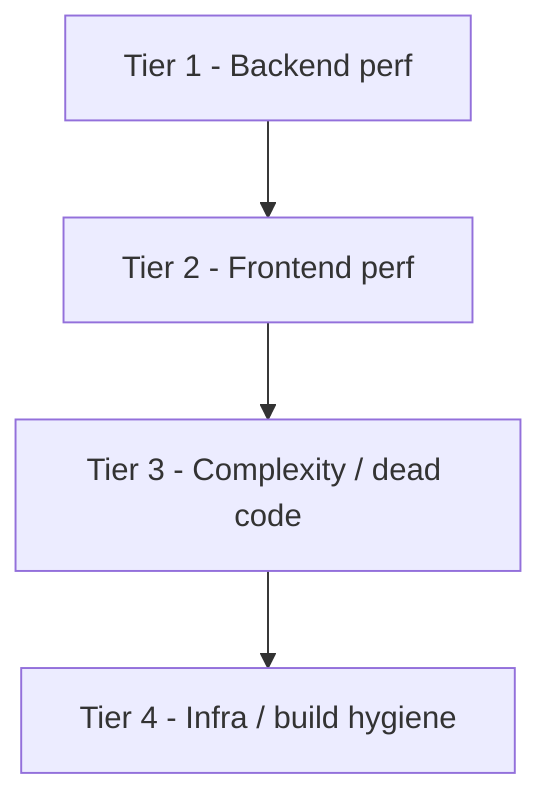

# Performance & Complexity Analysis — Implementation Plan

## How to use this document

Each task below follows the same structure:

- **ID** — short identifier for cross-references and PR titles.
- **Problem** — the symptom or anti-pattern.
- **Files** — exact paths (and line numbers when stable).
- **Implementation steps** — ordered, concrete actions.
- **Acceptance criteria** — verifiable conditions that prove the task is done.
- **Risks / dependencies** — anything that could go wrong or other tasks that must precede this one.

The codebase **already uses Postgres remotely** and **SQLite for tests**. Do not introduce MySQL, do not add Postgres or MySQL containers to `docker-compose.yml`, and do not touch anything under [legacy-db/](legacy-db/) (those files are intentional archival imports).

The work is grouped into four tiers. Tiers are independently shippable and ordered by user-visible impact.



---

## Tier 1 — Backend Performance

### T1.1 — Move cache, session, queue to Redis

- **Problem:** Every authenticated request writes a session row to Postgres; every cache read/write and queue dispatch is a DB round trip. This is the largest latency multiplier in the stack.
- **Files:**
  - [config/cache.php](config/cache.php) line 18 (`'default' => env('CACHE_STORE', 'database')`)
  - [config/session.php](config/session.php) line 21 (`'driver' => env('SESSION_DRIVER', 'database')`)
  - [config/queue.php](config/queue.php) line 16 (`'default' => env('QUEUE_CONNECTION', 'database')`)
  - [.env](.env) lines 37, 45, 47
  - [.env.example](.env.example) lines 64, 66 (defaults shown to new developers)
- **Implementation steps:**
  1. Provision a Redis instance reachable from the app (use the same remote pattern as Postgres, or run Redis locally via Compose — see T4.1).
  2. In `.env`, set `CACHE_STORE=redis`, `SESSION_DRIVER=redis`, `QUEUE_CONNECTION=redis`. Confirm `REDIS_HOST`, `REDIS_PORT`, `REDIS_PASSWORD` are accurate.
  3. In `.env.example`, change the default values to `redis` and update the surrounding comments. Keep `database` documented as a fallback.
  4. After deploy, run `php artisan queue:restart` so workers pick up the new connection.
- **Acceptance criteria:**
  - `php artisan tinker -e "Cache::driver()->getStore() |> get_class"` returns a Redis store class.
  - No new rows appear in the `sessions`, `cache`, or `jobs` tables under load.
  - Queue jobs visible via `redis-cli LRANGE queues:default 0 -1` (or your chosen queue name).
- **Risks / dependencies:**
  - Sessions are session-cookie-coupled; deploying mid-traffic invalidates active sessions unless you migrate them. Acceptable to log everyone out during a maintenance window.
  - Required dependency for T4.1 to be useful.

---

### T1.2 — Align job timeout with queue `retry_after`

- **Problem:** The CSV import job has `$timeout = 300` but the database queue's default `retry_after` is 90 seconds. A worker running past 90s will be re-dispatched concurrently, causing duplicate inserts and duplicate broadcasts.
- **Files:**
  - [app/Jobs/LoadCustomersFromCsvJob.php](app/Jobs/LoadCustomersFromCsvJob.php) line 19 (`public int $timeout = 300;`)
  - [config/queue.php](config/queue.php) line 43 (database connection block)
- **Implementation steps:**
  1. After T1.1 lands, this becomes a property of the Redis queue config block. Set `retry_after` to **at least `$timeout + 60`** (recommend 420).
  2. In [config/queue.php](config/queue.php), inside the `redis` connection (added by T1.1), set `'retry_after' => env('QUEUE_RETRY_AFTER', 420)`. Add `QUEUE_RETRY_AFTER=420` to `.env` and `.env.example`.
  3. Update worker invocation in [docker-compose.yml](docker-compose.yml) line 71: change `--max-time=3600` to also include `--timeout=300` so the worker kills the job at the same boundary the job declares.
- **Acceptance criteria:**
  - `config('queue.connections.redis.retry_after')` returns `420`.
  - Running an import that takes >2 minutes does **not** produce duplicate rows or duplicate broadcast events.
- **Risks / dependencies:** Depends on T1.1.

---

### T1.3 — Make import progress broadcasts asynchronous

- **Problem:** [app/Events/DataLoad/DataImportProgressUpdated.php](app/Events/DataLoad/DataImportProgressUpdated.php) line 12 implements `ShouldBroadcastNow`, blocking the worker on each Reverb publish. Combined with the per-row tick in the import loop, this dominates job runtime.
- **Files:**
  - [app/Events/DataLoad/DataImportProgressUpdated.php](app/Events/DataLoad/DataImportProgressUpdated.php) line 12
  - [app/Jobs/LoadCustomersFromCsvJob.php](app/Jobs/LoadCustomersFromCsvJob.php) lines 222–235, 294
- **Implementation steps:**
  1. In `DataImportProgressUpdated`, change `implements ShouldBroadcastNow` → `implements ShouldBroadcast` (and update the `use` statement).
  2. Add a `broadcastQueue` property: `public string $broadcastQueue = 'broadcasts';` so progress events don't compete with the import job for the default queue.
  3. Throttle ticks in `LoadCustomersFromCsvJob`: only emit when (rows since last broadcast >= max(50, total/100)) **or** (now() - lastBroadcastAt) >= 1 second. Always emit the first and last tick.
  4. Run a dedicated worker for the `broadcasts` queue: add a sibling Compose service or extend the queue command in [docker-compose.yml](docker-compose.yml) line 71 to `--queue=broadcasts,default`.
- **Acceptance criteria:**
  - Importing a 10k-row CSV produces at most ~100 broadcast events (not 10,000).
  - Running `php artisan queue:work broadcasts` shows the events being handled separately from the import job.
- **Risks / dependencies:** Depends on T1.1 (Redis queue) for the secondary queue.

---

### T1.4 — Commit CSV import per chunk instead of one giant transaction

- **Problem:** [app/Jobs/LoadCustomersFromCsvJob.php](app/Jobs/LoadCustomersFromCsvJob.php) lines 68–70 wrap **all** chunked inserts in one `DB::transaction`. Memory and WAL grow with file size; a failure near the end discards all work.
- **Implementation steps:**
  1. Move the `DB::transaction(...)` call **inside** the chunk loop so each chunk commits independently.
  2. Replace `Customer::insert($chunk)` with `Customer::upsert($chunk, uniqueBy: ['email'], update: [...])` so re-running a partially-completed import is idempotent. (This requires the unique index from T1.5.)
  3. Persist a `last_processed_offset` (rows processed) on the data-load record so a retry resumes instead of restarting.
- **Acceptance criteria:**
  - Importing a 100k-row CSV completes without `pg_xlog` blow-up; failed midway, re-running resumes from the last committed offset and produces no duplicates.
  - Lock wait events on `customers` during import are limited to chunk-sized windows.
- **Risks / dependencies:**
  - Depends on T1.5 (unique email index) for `upsert` to work efficiently.
  - Failure semantics change — document that partial imports are committed.

---

### T1.5 — Indexes on `customers` search/sort columns *(implemented)*

- **Context:** [app/Http/Controllers/CustomerController.php](app/Http/Controllers/CustomerController.php) lines 38–46 search and sort by `full_name`, `phone_number`, `email`. B-tree indexes and PostgreSQL trigram GIN indexes are defined in [database/migrations/2026_04_09_220754_create_customers_table.php](database/migrations/2026_04_09_220754_create_customers_table.php) (`$table->unique('email')`, `index()` on `full_name`, `phone_number`, `created_at`; after `Schema::create`, a `pgsql`-only block runs `CREATE EXTENSION IF NOT EXISTS pg_trgm` and the `customers_*_trgm_idx` GIN indexes). No separate alter migrations.
- **Verification (still worth running):**
  1. `EXPLAIN ANALYZE` on the customer list query shows `Index Scan` (not `Seq Scan`) for sorted/filtered queries at scale.
  2. Trigram-style search query plan uses `Bitmap Index Scan` on the GIN index where applicable.
- **Risks / dependencies:**
  - `pg_trgm` requires the DB role to have permission to create extensions; if not, run `CREATE EXTENSION pg_trgm` once manually as a superuser.
  - The unique `email` constraint will fail on migrate if duplicates exist. Pre-clean duplicates before `migrate` on dirty data.

---

### T1.6 — Production cache step is incomplete

- **Problem:** [docker/entrypoint.sh](docker/entrypoint.sh) lines 92–93 only run `config:cache` and `route:cache`. Blade views and event discovery are recomputed on every request.
- **Implementation steps:**
  1. Replace the two cache calls with a single `php artisan optimize` (covers config/route/view/event).
  2. Add `run_as_www_data "php artisan storage:link --force"` immediately after `optimize` (idempotent; needed because [config/filesystems.php](config/filesystems.php) lines 76–78 declare a public symlink).
  3. The `LARAVEL_CONTAINER_ROLE=reverb` early return at line 64 already skips this block; leave it.
- **Acceptance criteria:**
  - First request after a fresh container boot is no slower than subsequent requests.
  - `bootstrap/cache/views.php` exists; `bootstrap/cache/events.php` exists.
  - `public/storage` symlink resolves to `storage/app/public` inside the container.

---

### T1.7 — OPcache and JIT tuning for the production image

- **Problem:** [docker/Dockerfile](docker/Dockerfile) lines 128–129 use stock production INI. Defaults assume a development workflow (`validate_timestamps=1`) and don't size memory for a real app.
- **Implementation steps:**
  1. Create `docker/php.production.ini` with:
     ```ini
     opcache.enable=1
     opcache.enable_cli=0
     opcache.memory_consumption=256
     opcache.interned_strings_buffer=32
     opcache.max_accelerated_files=20000
     opcache.validate_timestamps=0
     opcache.revalidate_freq=0
     opcache.save_comments=1
     opcache.fast_shutdown=1
     opcache.jit=tracing
     opcache.jit_buffer_size=128M
     realpath_cache_size=4096K
     realpath_cache_ttl=600
     ```
  2. In the runtime stage of [docker/Dockerfile](docker/Dockerfile) (after line ~128), `COPY docker/php.production.ini /usr/local/etc/php/conf.d/zz-production.ini`.
  3. Rebuild image; `php -i | grep opcache.jit` should show `tracing` and a non-zero buffer.
- **Acceptance criteria:**
  - `php -r "var_dump(opcache_get_status()['jit']);"` shows `enabled => true, on => true`.
  - Synthetic load test (e.g., `wrk -t4 -c64 -d30s`) shows lower median latency vs the unmodified image.
- **Risks / dependencies:**
  - `validate_timestamps=0` means a code change requires a container restart to be picked up. This is correct for an immutable image but ensure deployment automation restarts containers, not just bind-mounts new code.

---

## Tier 2 — Frontend Performance

### T2.1 — Vendor chunk splitting in Vite

- **Problem:** [vite.config.ts](vite.config.ts) lines 8–25 has plugins only — no `build.rollupOptions.output.manualChunks`. Heavy shared deps (`@radix-ui/*`, `@tanstack/react-table`, `lucide-react`, `laravel-echo`, `pusher-js`) collapse into one giant vendor chunk shipped on first paint.
- **Note:** Inertia's default resolver in [resources/js/app.tsx](resources/js/app.tsx) already lazy-loads pages via `import.meta.glob`. The issue is purely vendor splitting.
- **Implementation steps:**
  1. Extend the Vite config:
     ```ts
     export default defineConfig({
         plugins: [ /* unchanged */ ],
         build: {
             sourcemap: false,
             chunkSizeWarningLimit: 600,
             rollupOptions: {
                 output: {
                     manualChunks: {
                         'react-vendor': ['react', 'react-dom'],
                         'inertia-vendor': ['@inertiajs/react'],
                         'radix-vendor': [
                             '@radix-ui/react-avatar',
                             '@radix-ui/react-checkbox',
                             '@radix-ui/react-collapsible',
                             '@radix-ui/react-dialog',
                             '@radix-ui/react-dropdown-menu',
                             '@radix-ui/react-label',
                             '@radix-ui/react-navigation-menu',
                             '@radix-ui/react-select',
                             '@radix-ui/react-separator',
                             '@radix-ui/react-slot',
                             '@radix-ui/react-toggle',
                             '@radix-ui/react-toggle-group',
                             '@radix-ui/react-tooltip',
                         ],
                         'realtime-vendor': ['laravel-echo', 'pusher-js'],
                         'table-vendor': ['@tanstack/react-table'],
                         'icons-vendor': ['lucide-react'],
                     },
                 },
             },
         },
     });
     ```
  2. Run `npm run build`; inspect `public/build/manifest.json` and confirm separate chunks exist.
- **Acceptance criteria:**
  - `dist`/`public/build` shows distinct `*-react-vendor-*.js`, `*-radix-vendor-*.js`, etc.
  - The largest single JS chunk shipped on first paint is < 250 KB gzipped.

---

### T2.2 — Slim the Inertia shared `auth.user` payload

- **Problem:** [app/Http/Middleware/HandleInertiaRequests.php](app/Http/Middleware/HandleInertiaRequests.php) lines 41–43 passes `$request->user()` directly. Every Inertia visit ships the entire `users` row (and any future sensitive columns added later).
- **Implementation steps:**
  1. Replace the `'user' => $request->user()` line with an explicit shape:
     ```php
     'user' => fn () => $request->user() ? [
         'id' => $request->user()->id,
         'name' => $request->user()->name,
         'email' => $request->user()->email,
         'two_factor_enabled' => $request->user()->hasEnabledTwoFactorAuthentication(),
     ] : null,
     ```
  2. Update the matching TS type (search for `auth.user` usages in `resources/js/types/`) so the frontend reflects the new shape.
- **Acceptance criteria:**
  - The Inertia page payload visible in DevTools no longer includes `password`-adjacent or timestamp fields.
  - `tsc --noEmit` passes with the new shape.

---

### T2.3 — Slim `customers.index` payload + defer detail fields

- **Problem:** [app/Http/Controllers/CustomerController.php](app/Http/Controllers/CustomerController.php) line 67 calls `Customer::paginate(10)` which selects `*`. Detail-only fields (notes, addresses, etc.) ride along for every list render.
- **Implementation steps:**
  1. Constrain the selected columns:
     ```php
     $query->select(['id', 'full_name', 'email', 'phone_number', 'phone_country', 'created_at']);
     ```
  2. For the customer profile dialog, switch the heavy detail fetch to an `Inertia::defer(fn () => ...)` prop that loads only when the dialog is opened.
  3. On the React side, use `<Deferred data="customer">` (or `WhenVisible`) to render a skeleton while the deferred prop streams in.
- **Acceptance criteria:**
  - Initial customer index payload size drops noticeably (verify in Network tab).
  - Profile dialog still renders all detail fields, fetched on open.

---

### T2.4 — Memoize phone-country lookups

- **Problem:** [resources/js/components/customers/customers-columns.tsx](resources/js/components/customers/customers-columns.tsx) lines 26–28 and [resources/js/components/customers/customer-profile-dialog.tsx](resources/js/components/customers/customer-profile-dialog.tsx) lines 163–166, 190–192 call `findPhoneCountryByName(...)` inside render — for every row, every render.
- **Implementation steps:**
  1. In the phone-country support module (search `findPhoneCountryByName`), add a module-scope `Map`:
     ```ts
     const PHONE_COUNTRY_BY_NAME = new Map(PHONE_COUNTRIES.map((c) => [c.name, c]));
     export function findPhoneCountryByName(name: string) {
         return PHONE_COUNTRY_BY_NAME.get(name) ?? null;
     }
     ```
  2. Verify all call sites still type-check (the public signature is unchanged).
- **Acceptance criteria:**
  - Function body is O(1) lookup.
  - React Profiler shows lower self-time on the customer table cell.

---

### T2.5 — Add `prefetch` on high-probability navigation links

- **Problem:** Navigation between the dashboard, customers, settings is the hot path. Inertia `<Link>` supports `prefetch` but it's missing on key entries.
- **Files (add `prefetch` prop, prefer `prefetch="hover"` to avoid wasted bandwidth):**
  - [resources/js/components/app-header.tsx](resources/js/components/app-header.tsx) lines 82–86, 116–131
  - [resources/js/layouts/settings/layout.tsx](resources/js/layouts/settings/layout.tsx) line 57
  - [resources/js/pages/LandingPages/_layout.tsx](resources/js/pages/LandingPages/_layout.tsx) lines 83, 94–105, 118–125
  - [resources/js/pages/LandingPages/index.tsx](resources/js/pages/LandingPages/index.tsx) lines 77–88, 170–181
- **Implementation steps:**
  1. For each `<Link>` listed, add `prefetch="hover"` (or `prefetch` for above-the-fold primary nav).
  2. Do **not** prefetch on auth-protected destinations from a public page (no payload benefit and wastes bandwidth on bots).
- **Acceptance criteria:** Hovering a nav link in DevTools shows a queued partial visit before click.

---

### T2.6 — Gate Inertia SSR by environment

- **Problem:** [config/inertia.php](config/inertia.php) lines 19–20 hard-enables SSR with a localhost URL. In any environment without the SSR daemon running, requests still attempt SSR and fall back with extra latency.
- **Implementation steps:**
  1. Change to:
     ```php
     'enabled' => env('INERTIA_SSR_ENABLED', false),
     'url' => env('INERTIA_SSR_URL', 'http://127.0.0.1:13714'),
     ```
  2. Set `INERTIA_SSR_ENABLED=true` only in environments that run `php artisan inertia:start-ssr`.
- **Acceptance criteria:** With `INERTIA_SSR_ENABLED=false`, no SSR HTTP attempt appears in logs.

---

## Tier 3 — Complexity & Dead Code Reduction

### T3.1 — Remove unused `@headlessui/react`

- **Problem:** [package.json](package.json) line 34 declares `@headlessui/react` but no `import` statement references it in `resources/js/`.
- **Implementation steps:**
  1. Confirm absence: `rg "@headlessui/react" resources/js` returns nothing.
  2. `npm uninstall @headlessui/react`.
- **Acceptance criteria:** `npm run build` succeeds; no chunk contains Headless UI.

---

### T3.2 — Standardize on a single package manager

- **Problem:** The repo carries an active npm lockfile alongside [pnpm-workspace.yaml](pnpm-workspace.yaml) and [.npmrc](.npmrc) (`ignore-scripts=true`). Mixed signals confuse contributors and tooling.
- **Implementation steps:**
  1. Delete [pnpm-workspace.yaml](pnpm-workspace.yaml).
  2. Review [.npmrc](.npmrc): if `ignore-scripts=true` is intentional for security, keep with a comment explaining why; otherwise delete.
  3. Update [AGENTS.md](AGENTS.md) and any contributor docs to mention only npm.
- **Acceptance criteria:** Only one lockfile (`package-lock.json`); only one workspace declaration.

---

### T3.3 — Replace allow-all `CustomerPolicy` with real authorization

- **Problem:** [app/Policies/CustomerPolicy.php](app/Policies/CustomerPolicy.php) lines 13–64 — every method `return true`. The controller calls `$this->authorize(...)` everywhere, which reads as security but does nothing.
- **Implementation steps:**
  1. Decide the access model with the product owner. Two reasonable defaults:
     - **Single-tenant admin app:** delete the policy file, remove `authorize()` calls, and rely on `auth+verified` middleware (already applied).
     - **Multi-user / role-based:** replace each method with the real check (`return $user->hasRole('staff')` or `$user->id === $customer->owner_id`).
  2. Whichever path is chosen, run `php artisan test` to verify nothing depended on the allow-all stub.
- **Acceptance criteria:** Either the policy is gone, or every method has a real predicate. No `return true` placeholders remain.

---

### T3.4 — Convert inline validation to Form Requests

- **Problem:** Controllers contain inline `$request->validate(...)` arrays that should be Form Requests.
- **Files:**
  - [app/Http/Controllers/CustomerController.php](app/Http/Controllers/CustomerController.php) lines 23–29
  - [app/Http/Controllers/DataLoaderController.php](app/Http/Controllers/DataLoaderController.php) lines 45–47
- **Implementation steps:**
  1. `php artisan make:request Customers/IndexCustomersRequest` and move the rules in.
  2. `php artisan make:request DataLoad/UploadCustomersRequest` and move the file rules in.
  3. Type-hint the new request classes in the controller signatures and replace `$request->validate(...)` with `$request->validated()`.
- **Acceptance criteria:** Controllers contain no `$request->validate(...)` calls; all validation lives in Form Request classes.

---

### T3.5 — Remove `env()` calls outside config files

- **Problem:** [app/Providers/AppServiceProvider.php](app/Providers/AppServiceProvider.php) line 69 reads `env('DB_CONNECTION', 'pgsql')` inside `boot()`. With `config:cache` enabled in production, `env()` returns `null` outside the bootstrap phase, leading to subtle prod-only bugs.
- **Implementation steps:**
  1. Replace line 69 with `'database.default' => config('database.default')`.
  2. The runtime check at lines 75–79 already pins `'database.default' => 'pgsql'` for non-testing environments, which is correct after T3.6.
- **Acceptance criteria:** `rg "env\(" app/` returns no matches in `app/` (config files are still allowed).

---

### T3.6 — Standardize all references on Postgres + SQLite-for-tests

- **Problem:** The project has finished migrating from MySQL to Postgres but stale MySQL references linger in `.env`, `.env.example`, and provider comments. They mislead new developers and risk a config-cache footgun if `DB_CONNECTION=mysql` is ever cached against [config/database.php](config/database.php) (which only defines `pgsql` and `sqlite`).
- **Files & required changes:**
  - [.env](.env) line 27: change `DB_CONNECTION=mysql` → `DB_CONNECTION=pgsql`.
  - [.env](.env) lines 28, 30, 33, 35: rewrite the surrounding comments to remove all MySQL references; reflect that Postgres is canonical and the host port is 5432.
  - [.env](.env) lines 77, 81–87, 94: scrub the bottom block — remove `MYSQL_*`, `DB_PORT=3306`, etc. Replace with the Compose-relevant Postgres / Redis / Reverb hints (mirror the cleaned [.env.example](.env.example) lower section).
  - [.env.example](.env.example): already mostly Postgres; verify no stray MySQL words remain.
  - [app/Providers/AppServiceProvider.php](app/Providers/AppServiceProvider.php) line 77: rewrite the comment to drop the "when .env still says mysql" phrasing — it is no longer relevant.
  - [phpunit.xml](phpunit.xml) lines 27–29: confirmed correct (`DB_CONNECTION=sqlite`, `DB_DATABASE=:memory:`). No change.
- **Implementation steps:**
  1. Edit `.env` and `.env.example` to remove every MySQL reference (commented or live). Keep two connection types only: `pgsql` (default) and `sqlite` (tests).
  2. Confirm [config/database.php](config/database.php) lines 32–62 still defines exactly `sqlite` and `pgsql` — no additions needed.
  3. Update `app/Providers/AppServiceProvider.php` comment at line 77 to read e.g. `// Production runs against pgsql only; sqlite is reserved for tests.`.
  4. `rg -i "mysql|mariadb" -- ':!legacy-db' ':!vendor' ':!node_modules'` should return zero matches in app code (matches inside `.cursor/skills/` rule docs are documentation about cross-DB ordering and may stay).
- **Acceptance criteria:**
  - `php artisan config:clear && php artisan migrate --pretend` works against the remote Postgres without touching MySQL config keys.
  - `php artisan test` still passes (uses SQLite in-memory).
  - Greppable references to MySQL in app/config/env are gone.
- **Risks / dependencies:** None — codebase already runs on Postgres; this is documentation/config hygiene.

---

### T3.7 — Delete dead code

- **Problem:** Several files / methods are unreferenced.
- **Files to remove or trim:**
  - [app/Services/DataLoad/CustomerLoadService.php](app/Services/DataLoad/CustomerLoadService.php) lines 21–24 — `loaderKey()` has no callers; remove.
  - [app/Support/PhoneCountry.php](app/Support/PhoneCountry.php) lines 91–106 — `usesNanpMask()` and `dialDigits()` unreferenced; remove.
  - [resources/js/layouts/app/app-header-layout.tsx](resources/js/layouts/app/app-header-layout.tsx) lines 1–17 — never imported; delete the file.
  - [routes/console.php](routes/console.php) — empty; delete.
- **Implementation steps:**
  1. Before each deletion, re-verify with `rg "loaderKey|usesNanpMask|dialDigits|app-header-layout"`.
  2. Remove. Run `php artisan test` and `npm run types:check`.
- **Acceptance criteria:** `php artisan test`, `npm run lint:check`, `npm run types:check` all pass.

---

### T3.8 — Replace hardcoded landing-page URLs with Wayfinder routes

- **Problem:** Landing pages bypass Wayfinder's typed routes, drifting silently when backend routes change.
- **Files (replace hardcoded paths with imports from `@/routes`):**
  - [resources/js/pages/LandingPages/_layout.tsx](resources/js/pages/LandingPages/_layout.tsx) lines 11–14, 83, 118–125
  - [resources/js/pages/LandingPages/index.tsx](resources/js/pages/LandingPages/index.tsx) lines 78, 84, 171, 177
  - [resources/js/pages/LandingPages/overview.tsx](resources/js/pages/LandingPages/overview.tsx) lines 152, 158
  - [resources/js/pages/LandingPages/demo.tsx](resources/js/pages/LandingPages/demo.tsx) lines 90, 96
  - [resources/js/pages/LandingPages/contact.tsx](resources/js/pages/LandingPages/contact.tsx) lines 71, 77
- **Implementation steps:**
  1. Run `npm run build` once to materialize Wayfinder output (or rely on dev server).
  2. For each hardcoded path, find the matching named route in `@/routes` and substitute (e.g. `href="/login"` → `href={login.url()}`).
  3. If a landing page links to an external/static URL (not a Laravel route), leave it.
- **Acceptance criteria:** `tsc --noEmit` passes; clicking each landing CTA navigates as before.

---

### T3.9 — Extract page-level concerns into hooks

- **Problem:** Two pages mix UI, networking, polling, and persistence into single 400+ line files.
- **Files:**
  - [resources/js/pages/data-load/customers.tsx](resources/js/pages/data-load/customers.tsx) (~450 lines)
  - [resources/js/pages/customers/index.tsx](resources/js/pages/customers/index.tsx) (~413 lines)
- **Implementation steps:**
  1. Create `resources/js/hooks/use-csv-import.ts` containing: upload, polling, Echo subscription, status reducer. Returns `{ status, progress, start, cancel }`. The data-load page becomes a thin renderer.
  2. Create `resources/js/hooks/use-customer-list-query.ts` containing: query string parsing, filter/sort state, pagination handlers. Returns the active params plus setters.
  3. Move shared types into `resources/js/types/`.
- **Acceptance criteria:** Both pages drop below ~200 lines; the hooks are independently importable from a future page.

---

### T3.10 — Use `useForm` for the CSV upload

- **Problem:** [resources/js/pages/data-load/customers.tsx](resources/js/pages/data-load/customers.tsx) lines 121–128, 274–283 use raw `fetch` for upload, reimplementing CSRF, error mapping, and progress that Inertia already provides.
- **Implementation steps:**
  1. Replace the upload `fetch` with Inertia's `useForm({ file: null }).post(uploadAction.url(), { forceFormData: true })`.
  2. Keep raw `fetch` only for the JSON status poll if the WebSocket fallback path needs it.
- **Acceptance criteria:** Upload works, server-side validation errors surface via `errors.file`, and CSRF is no longer manually attached.

---

### T3.11 — Inline thin layout wrappers (optional)

- **Problem:** [resources/js/layouts/app-layout.tsx](resources/js/layouts/app-layout.tsx) and [resources/js/layouts/auth-layout.tsx](resources/js/layouts/auth-layout.tsx) are one-line forwarders.
- **Implementation steps:**
  1. If the indirection is genuinely planned for future variants, leave them and note the intent in a comment.
  2. Otherwise, replace the imports in [resources/js/app.tsx](resources/js/app.tsx) lines 5–7 with the underlying templates and delete the wrapper files.
- **Acceptance criteria:** The mental model "what wraps a page?" is answerable by reading `app.tsx` in one hop.

---

## Tier 4 — Infrastructure & Build Hygiene

### T4.1 — Add only Redis to docker-compose (DB stays remote)

- **Problem:** [docker-compose.yml](docker-compose.yml) defines `app`, `queue`, `reverb` but no Redis. With T1.1 in flight, a local-dev Redis is required. The Postgres database is **remote** and must **not** be added to Compose.
- **Implementation steps:**
  1. Add a `redis` service (`redis:7-alpine`), expose port `6379` only on the internal `bm-network`, mount a named volume for persistence:
     ```yaml
     redis:
       container_name: bm-redis
       image: redis:7-alpine
       restart: unless-stopped
       command: ["redis-server", "--appendonly", "yes"]
       volumes:
         - bm-redis-data:/data
       networks:
         - bm-network
       healthcheck:
         test: ["CMD", "redis-cli", "ping"]
         interval: 5s
         timeout: 3s
         retries: 5
     ```
     Append `bm-redis-data:` under the existing `volumes:` block at line 113.
  2. Add `depends_on: { redis: { condition: service_healthy } }` on `app` and `queue`.
  3. Set `REDIS_HOST=redis` in the app/queue `environment:` blocks.
  4. **Do not** add Postgres or MySQL services. The remote Postgres at `db.mattapps.org:5433` is the canonical database.
- **Acceptance criteria:**
  - `docker compose up` starts a healthy `bm-redis` container.
  - The app and queue containers can `redis-cli -h redis ping` successfully.
  - No DB container is added; `DB_HOST` continues pointing at the remote Postgres.
- **Risks / dependencies:** Required for T1.1 in local development.

---

### T4.2 — Align broadcasting env between local and reference

- **Problem:** [.env.example](.env.example) line 48 defaults to `BROADCAST_CONNECTION=reverb` while the live [.env](.env) line 43 has `log`. Behavior diverges silently.
- **Implementation steps:**
  1. Decide canonical default and document in [.env.example](.env.example) with a comment ("Use `reverb` when running the reverb service; use `log` only when broadcasts are not required for the workflow under development").
  2. In the live `.env`, set the value that matches the developer's actual setup. There is no code change required; only documentation alignment.
- **Acceptance criteria:** `.env.example` clearly states which value to use when.

---

### T4.3 — Use `npm ci` in CI workflows

- **Problem:** [.github/workflows/tests.yml](.github/workflows/tests.yml) line 41 and [.github/workflows/lint.yml](.github/workflows/lint.yml) line 34 run `npm install` — non-deterministic and slower than `npm ci`.
- **Implementation steps:** Replace `npm install` (or `npm i`) with `npm ci` in both workflow files.
- **Acceptance criteria:** CI logs show `npm ci`; CI fails fast if `package-lock.json` is out of sync (the desired behavior).

---

### T4.4 — Drop write permission on lint workflow

- **Problem:** [.github/workflows/lint.yml](.github/workflows/lint.yml) lines 17–18 grant `contents: write` while the auto-commit step (lines 45–50) is commented out.
- **Implementation steps:** Change `contents: write` → `contents: read`. If the auto-commit is reinstated later, restore write permission at that time.
- **Acceptance criteria:** Workflow file shows `contents: read`; the lint job still passes.

---

### T4.5 — Decide and document the Wayfinder generated-file policy

- **Problem:** The Wayfinder Vite plugin generates `resources/js/actions`, `resources/js/routes`, `resources/js/wayfinder` at build time ([vite.config.ts](vite.config.ts) lines 21–23). [.gitignore](.gitignore) lines 9–11 ignores them; [eslint.config.js](eslint.config.js) lines 116–120 ignores them. Editor IntelliSense depends on the files existing, which depends on every developer running `npm run build` (or `npm run dev`) at least once.
- **Implementation steps (pick one):**
  - **Option A (recommended):** keep them gitignored, and add a top-level `prepare` script in [package.json](package.json) that runs the Wayfinder generator so a fresh `npm install` produces them. Document in [AGENTS.md](AGENTS.md).
  - **Option B:** commit the generated files. Remove them from `.gitignore`; keep the eslint ignore. Note this in the README.
- **Acceptance criteria:** New contributor can clone → `npm install` → open the editor and see typed routes resolve without manual extra steps.

---

### T4.6 — Rotate any credentials currently stored in `.env`

- **Problem:** [.env](.env) line 26 contains a full Postgres URL with credentials. If the file is ever copied (chat, screenshot, support ticket) those creds leak.
- **Implementation steps:**
  1. Rotate the Postgres password at the database.
  2. Inject the new credentials via the deployment platform's secret store (Railway, Fly, Kubernetes secret, etc.). Local developers receive credentials out-of-band.
  3. Replace the value in `.env` with a placeholder for documentation purposes if the file must be checked in to a private repo; otherwise ensure `.env` is gitignored ([.gitignore](.gitignore) does ignore it — verify).
- **Acceptance criteria:** Old password no longer accepted by the DB; the application boots with new credentials sourced from the secret store.

---

## Out of scope (explicitly)

- **Adding any database container to docker-compose.** The Postgres database lives on a remote host; do not introduce a `postgres` or `mysql` service.
- **Adding new test files.** Per the original analysis request, no new tests are produced. Existing tests must continue to pass after each tier.
- **Touching anything under [legacy-db/](legacy-db/).** Those archival exports stay in place and are gitignored already.

---

## Verification checklist

After each tier, run:

```bash
composer ci:check
npm run build
docker compose up --build
```

A successful run plus the per-task acceptance criteria above is sufficient evidence the tier is complete.
