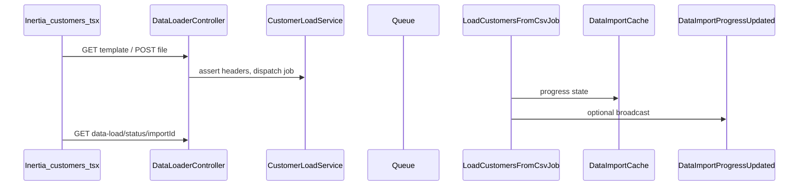

# Supplier data load (CSV) plan

## Reference architecture (customers)

End-to-end flow today:

Key files: [`app/Http/Controllers/DataLoaderController.php`](app/Http/Controllers/DataLoaderController.php), [`app/Services/DataLoad/CustomerLoadService.php`](app/Services/DataLoad/CustomerLoadService.php), [`app/Jobs/LoadCustomersFromCsvJob.php`](app/Jobs/LoadCustomersFromCsvJob.php), [`resources/js/pages/data-load/customers.tsx`](resources/js/pages/data-load/customers.tsx), [`resources/js/hooks/use-csv-import.ts`](resources/js/hooks/use-csv-import.ts), routes in [`routes/web.php`](routes/web.php) (lines 18–21), nav in [`resources/js/components/nav-data-loader.tsx`](resources/js/components/nav-data-loader.tsx). The generic status URL [`data-load/status/{importId}`](routes/web.php) and [`DataImportCache`](app/Support/DataImportCache.php) / [`DataImportProgressUpdated`](app/Events/DataLoad/DataImportProgressUpdated.php) stay as-is (channel is `data-import.{importId}`; UUID per run avoids collisions with customer imports).

## Supplier domain mapping

From [`database/migrations/2026_05_13_120000_create_suppliers_table.php`](database/migrations/2026_05_13_120000_create_suppliers_table.php) and [`app/Models/Supplier.php`](app/Models/Supplier.php):

| CSV header (proposed) | DB column | Notes |
|----------------------|-----------|--------|
| `contact_person_name` | `contact_person_name` | required, max 255 |
| `company_name` | `company_name` | required, max 255 |
| `phone` | `phone` | required, max 255 (single field; unlike customers) |
| `email` | `email` | required, lowercase email, max 255 |
| `address` | `address` | required string |
| `category` | `category` | must match [`SupplierCategory`](app/Enums/SupplierCategory.php) string values: `OEM`, `Aftermarket`, `Other` |

**Upsert key:** [`LoadCustomersFromCsvJob`](app/Jobs/LoadCustomersFromCsvJob.php) uses `Customer::upsert(..., ['email'], [...])`. [`customers`](database/migrations/2026_04_09_220754_create_customers_table.php) has `$table->unique('email')`. [`suppliers`](database/migrations/2026_05_13_120000_create_suppliers_table.php) does **not** yet define a unique index on `email`, while [`StoreSupplierRequest`](app/Http/Requests/SupplierRequests/StoreSupplierRequest.php) enforces `Rule::unique('suppliers', 'email')` at the app layer. Add a **follow-up migration** that adds `$table->unique('email')` on `suppliers` so `Supplier::upsert` is valid and behavior matches manual create rules (same trade-off as customers regarding soft-deleted rows and email reuse).

**UUID primary key:** New rows in upsert payloads must include `id` (e.g. `Str::uuid()->toString()` per row). On duplicate `email`, Laravel’s upsert updates only the listed columns; the existing row’s `id` is preserved (same pattern as long as `id` is not in the update column list).

## Backend implementation

1. **`App\Services\DataLoad\SupplierLoadService`** — Parallel to `CustomerLoadService`:
   - `expectedHeaders()` returning the six headers above.
   - `generateDataStructureTemplate()` → `supplier_import_template.csv`.
   - `startImport()` → dispatch new job.
   - `assertHeaderRowMatches()` / `stripUtf8BomFromFirstCell()` / `rowAssociative()` — copy the same strict header + BOM behavior.
   - `validateRowData()` — Reuse the same rules as [`StoreSupplierRequest::rules()`](app/Http/Requests/SupplierRequests/StoreSupplierRequest.php) except **omit** `Rule::unique` for per-row import (uniqueness is enforced at upsert time). Normalize `email` to lowercase. Validate `category` with `Rule::enum(SupplierCategory::class)` (or equivalent).

2. **`App\Jobs\LoadSuppliersFromCsvJob`** — Clone structure of `LoadCustomersFromCsvJob` (chunk size, progress/broadcast throttling, resume `last_processed_offset`, temp file cleanup, `ValidationException` → failed state). Replace `CustomerLoadService` / `Customer` with supplier equivalents; `flushSupplierChunk` builds rows including `id` (new UUID), `created_at` / `updated_at` / `deleted_at`, and `Supplier::upsert($payload, ['email'], [/* updatable columns excluding id */])`. Cast `category` to string value expected by DB (enum backed string).

3. **`App\Http\Requests\DataLoad\UploadSuppliersRequest`** — Same rules as [`UploadCustomersRequest`](app/Http/Requests/DataLoad/UploadCustomersRequest.php) (`file` required, csv/txt, max size).

4. **[`DataLoaderController`](app/Http/Controllers/DataLoaderController.php)** — Inject `SupplierLoadService`; add `suppliersPage`, `suppliersTemplate`, `suppliersUpload` mirroring customer methods with `$this->authorize('create', Supplier::class)` and `Inertia::render('data-load/suppliers')`.

5. **[`routes/web.php`](routes/web.php)** — Register:
   - `GET data-load/suppliers` (page)
   - `GET data-load/suppliers/template` (template)
   - `POST data-load/suppliers` (upload)  
   Reuse existing `data-load.status` route.

6. **Tests** — New `tests/Feature/DataLoad/SupplierDataLoadTest.php` modeled on [`CustomerDataLoadTest`](tests/Feature/DataLoad/CustomerDataLoadTest.php): guest/auth template, bad headers + temp file cleanup, valid upload dispatches job + pending event, status 403 for wrong user, optional job execution test that asserts suppliers created/updated by email.

## Frontend implementation

1. **[`resources/js/pages/data-load/suppliers.tsx`](resources/js/pages/data-load/suppliers.tsx)** — Copy [`customers.tsx`](resources/js/pages/data-load/customers.tsx); adjust copy, breadcrumb, template link, and document `category` allowed values in the card description.

2. **Generalize [`use-csv-import.ts`](resources/js/hooks/use-csv-import.ts)** — Replace the customer-only hardcoding with a small options object, for example:
   - `uploadUrl: string` (from Wayfinder)
   - `sessionStorageKey: string` (e.g. `bm_supplier_data_import_id` vs existing `bm_customer_data_import_id`)
   - Default or explicit `statusRoute` (unchanged URL shape).  
   Update [`customers.tsx`](resources/js/pages/data-load/customers.tsx) to pass customer upload URL + key. New suppliers page passes supplier upload URL + key. This avoids duplicating the entire Echo + polling + toast logic.

3. **[`nav-data-loader.tsx`](resources/js/components/nav-data-loader.tsx)** — Add a second sub-item (e.g. Lucide `Truck` or `Building2`) linking to the suppliers data-load page; set `defaultOpen` when **either** child route is active (reuse `isCurrentOrParentUrl` pattern for both hrefs).

4. **Wayfinder** — After PHP route/controller changes, run `php artisan wayfinder:generate` so `@/actions/.../DataLoaderController` exports `suppliersPage`, `suppliersTemplate`, `suppliersUpload` (document in PR/commit notes; the agent will run this after implementation).

## Finalize: plan in repository

**Canonical location:** this file, [`.cursor/plans/supplier_csv_data_load.md`](supplier_csv_data_load.md), under the **business-manager** repo (versioned with the project, next to other plans such as `Suppliers_implementation.md`).

After feature implementation is complete, update this document if any decisions diverged from the plan (e.g. different column names, upsert behavior). Mark todo `store-plan-doc` done once the doc reflects shipped behavior.

## Files to add

- `app/Services/DataLoad/SupplierLoadService.php`
- `app/Jobs/LoadSuppliersFromCsvJob.php`
- `app/Http/Requests/DataLoad/UploadSuppliersRequest.php`
- `database/migrations/*_add_unique_email_to_suppliers_table.php` (or equivalent name)
- `resources/js/pages/data-load/suppliers.tsx`
- `tests/Feature/DataLoad/SupplierDataLoadTest.php`

## Files to change

- [`DataLoaderController.php`](app/Http/Controllers/DataLoaderController.php), [`routes/web.php`](routes/web.php), [`use-csv-import.ts`](resources/js/hooks/use-csv-import.ts), [`customers.tsx`](resources/js/pages/data-load/customers.tsx), [`nav-data-loader.tsx`](resources/js/components/nav-data-loader.tsx)

No changes required to [`DataImportProgressNotifier`](app/Broadcasting/DataImportProgressNotifier.php) or the event/channel contract.
